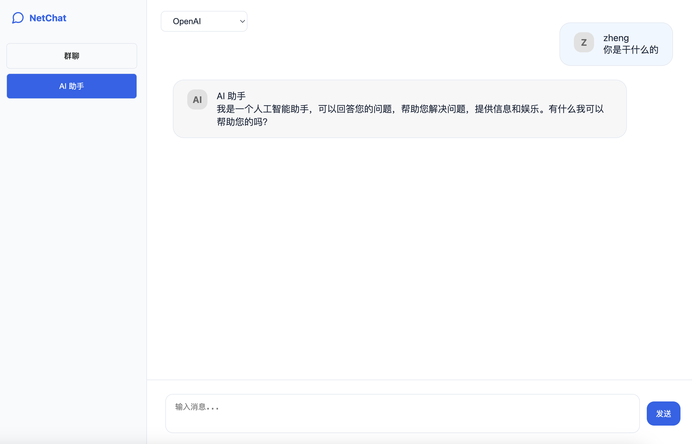
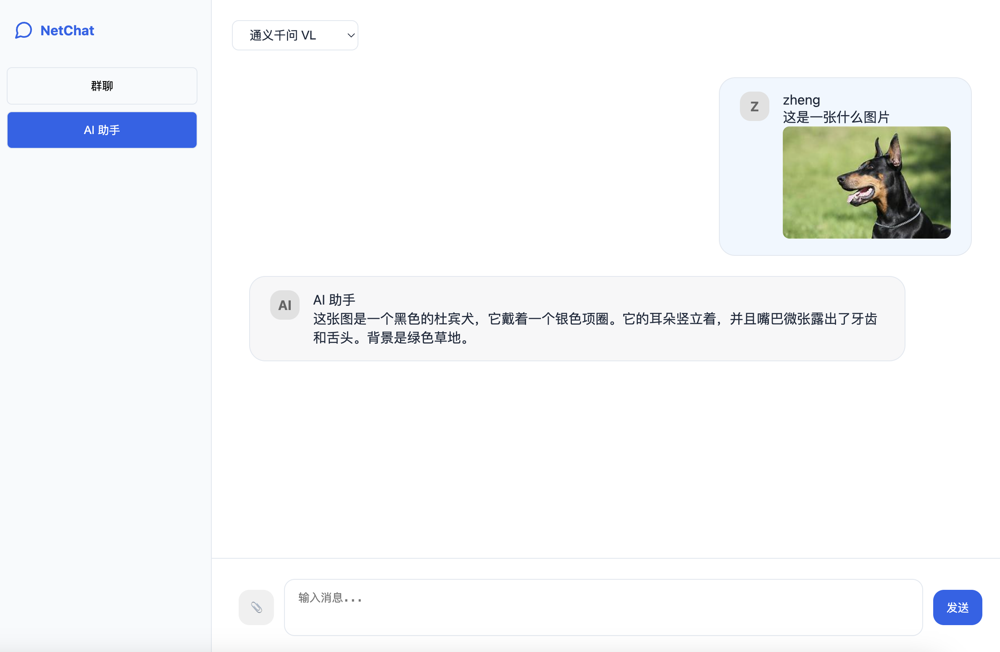

# NetChat - Real-time Chat Application
 
   

 <strong>[中文](./README_zh.md) | English</strong>
## 🌟 Overview
A modern real-time chat application built using Rust, WebSocket, and supporting multiple large language models, including OpenAI's GPT, Tongyi Qianwen, ChatGLM and Google's Gemini integration. NetChat supports group chat and AI assistant functions, and has file sharing capabilities.

## 🚀 Features

- **Real-time Communication**: Instant messaging using WebSocket technology
- **Dual Chat Modes**:
  - Group Chat: Real-time communication between multiple users
  - AI Assistant: One-on-one conversations with an AI powered by multiple language models including OpenAI's GPT, Tongyi Qianwen, ChatGLM, and Google's Gemini.
- **File Sharing**: Support for file uploads and downloads between users
- **User Authentication**: JWT-based authentication system
- **Markdown Support**: Rich text formatting with markdown syntax
- **Code Highlighting**: Syntax highlighting for multiple programming languages

## 📌 Interface Preview




## Prerequisites

- Rust toolchain (latest stable version)
- OpenAI/Chatglm/qwen/google Gemini API key

## Configuration

The application uses environment variables for configuration. These can be set in the `run.sh` script:

```bash
OPENAI_API_KEY="your_key"        # OpenAI API key
SERVER_HOST="0.0.0.0"            # Server host
SERVER_PORT="3000"               # Server port
UPLOAD_DIR="uploads"             # File upload directory
MAX_FILE_SIZE="10485760"         # Max file size (10MB)
```

## Installation

1. Clone the repository:
   ```bash
   git clone https://github.com/zheng0116/netchat.git
   cd netchat
   ```

2. Install dependencies:
   ```bash
   sh run.sh build
   ```

3. Set up configuration:
   ```bash
   # Configure OpenAI API key
   export OPENAI_API_KEY="your_key"
   ```

## Running the Application

### Development Mode

```bash
 sh run.sh start dev
```

### Production Mode

```bash
 sh run.sh start
```


## Project Structure

```
├── src/
│   ├── main.rs           # Application entry point
│   ├── ai_chat.rs        # AI chat implementation
│   └── auth.rs           # Authentication logic
├── static/
│   ├── chat.html         # Chat interface
│   └── login.html        # Login page
├── uploads/              # File upload directory
└── run.sh               # Run script
```

## Security

- All authentication is handled via JWT tokens
- File uploads are restricted by size and stored in a dedicated directory
- Passwords should be properly hashed in a production environment
- WebSocket connections are authenticated

## Contributing

Contributions are welcome! Please feel free to submit pull requests.

## License

This project is open-sourced under the MIT License.