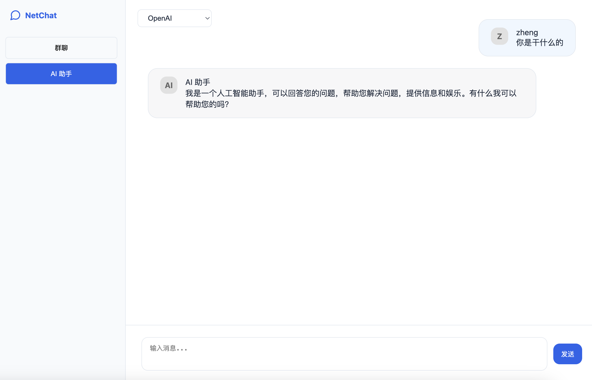

# NetChat - 实时聊天应用
    
 <strong>[英文](./README.md) | English</strong>
 ## 🌟 概述
一个使用 Rust、WebSocket 和 OpenAI 集成构建的现代实时聊天应用。NetChat 支持群聊和 AI 助手功能，并具备文件共享能力。

## 🚀 功能特性

- **实时通信**：使用 WebSocket 技术实现即时消息传递
- **双模式聊天**：
  - 群聊：用户之间的实时多人通信
  - AI 助手：与 OpenAI GPT 驱动的 AI 进行一对一对话
- **文件共享**：支持用户之间的文件上传和下载
- **用户认证**：基于 JWT 的认证系统
- **Markdown 支持**：支持使用 markdown 语法的富文本格式
- **代码高亮**：多种编程语言的语法高亮显示

## 📌 界面预览

## 技术栈

- **后端**：
  - Rust 编程语言
  - Axum web 框架
  - WebSocket 实现实时通信
  - JWT 实现身份认证
  - OpenAI API 集成

- **前端**：
  - HTML5
  - CSS3
  - JavaScript
  - highlight.js 实现代码语法高亮

## 环境要求

- Rust 
- OpenAI API 密钥

## 配置说明

应用程序使用环境变量进行配置。这些配置可以在 `.env` 中设置：

```bash
OPENAI_API_KEY="your_key"        # OpenAI API 密钥
SERVER_HOST="0.0.0.0"            # 服务器主机
SERVER_PORT="3000"               # 服务器端口
UPLOAD_DIR="uploads"             # 文件上传目录
MAX_FILE_SIZE="10485760"         # 最大文件大小（10MB）
```

## 安装步骤

1. 克隆仓库：
   ```bash
   git clone https://github.com/zheng0116/netchat.git
   cd netchat
   ```

2. 安装依赖：
   ```bash
   sh run.sh build
   ```

3. 设置配置：
   ```bash
   # 配置 OpenAI API 密钥，在 .env 文件中添加以下行：
   OPENAI_API_KEY="你的key"
   ```


## 运行应用

### 开发模式

```bash
 sh run.sh start dev
```

### 生产模式

```bash
 sh run.sh start
```


## 项目结构

```
├── src/
│   ├── main.rs           # 应用程序入口点
│   ├── ai_chat.rs        # AI 聊天实现
│   └── auth.rs           # 认证逻辑
├── static/
│   ├── chat.html         # 聊天界面
│   └── login.html        # 登录页面
├── uploads/              # 文件上传目录
└── run.sh               # 运行脚本
```

## 安全性

- 所有认证通过 JWT 令牌处理
- 文件上传受大小限制并存储在专用目录
- 在生产环境中密码应该proper进行哈希处理
- WebSocket 连接经过认证

## 贡献

欢迎提交贡献！请随时提交 pull requests。

## 许可证
这个项目是基于 MIT 许可证开源的。
